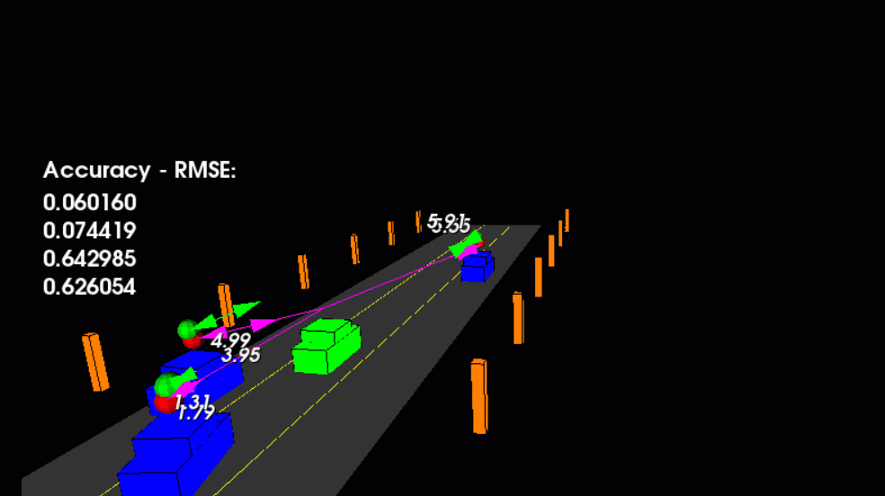
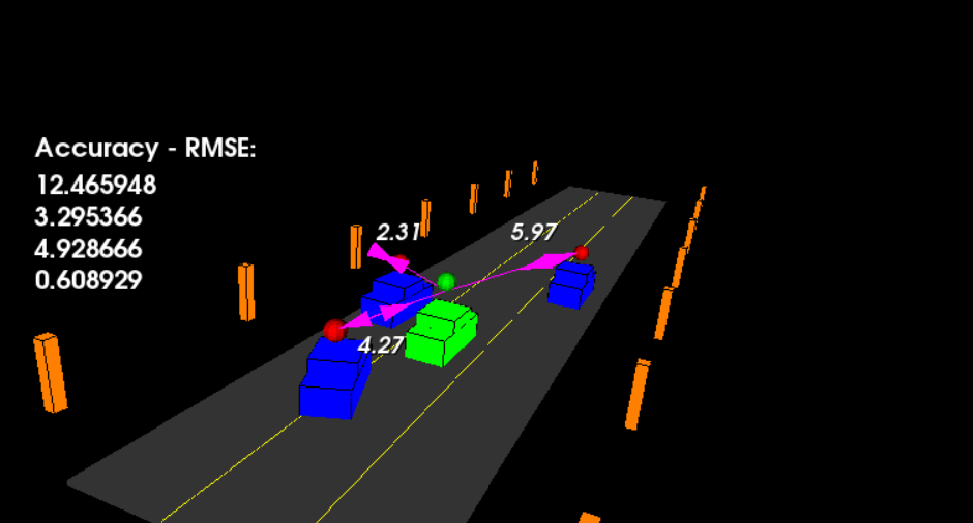

<div align="center">

# 🚗 Sensor Fusion — Unscented Kalman Filter Highway Tracking

### Multi-Vehicle Tracking using Radar, LiDAR, and Unscented Kalman Filtering


Unscented Kalman Filter implementation for multi-object tracking on a simulated highway.

</div>

---

# Overview

This project implements an Unscented Kalman Filter (UKF) to track multiple vehicles using noisy radar and lidar measurements.

The filter fuses data from both sensors to estimate:

- Vehicle position
- Vehicle velocity
- Vehicle trajectory

The simulation represents a highway environment with multiple moving vehicles whose states are continuously estimated and updated.

---

# Demonstration

<p align="center">
  
</p>

The animation shows the UKF tracking multiple vehicles on a simulated highway using radar and lidar measurements.

---

# Highway Scenario

<p align="center">
  
</p>

The simulation contains a straight three-lane highway with an ego vehicle and multiple traffic vehicles.

- Green vehicle → ego vehicle
- Blue vehicles → tracked traffic vehicles
- Red markers → lidar detections
- Purple lines → radar measurements
- RMSE values → live tracking accuracy

Each traffic vehicle has its own UKF instance, updated at every timestep.

---

# Project Objectives

The goal was to implement a complete Unscented Kalman Filter pipeline capable of:

- Fusing radar and lidar measurements
- Tracking multiple moving vehicles
- Handling non-linear motion
- Maintaining low estimation error
- Meeting strict RMSE requirements

---

# Why Unscented Kalman Filters?

Traditional Kalman Filters assume linear systems.

Vehicle motion and radar measurements are highly non-linear.

The Unscented Kalman Filter addresses this by:

- Generating sigma points
- Propagating sigma points through non-linear functions
- Reconstructing state statistics from transformed points

This often produces better accuracy than Extended Kalman Filters for strongly non-linear systems.

---

# Highway Scenario

The simulation contains:

- Ego vehicle
- Multiple traffic vehicles
- Radar observations
- LiDAR observations

Each traffic vehicle maintains its own UKF instance.

Vehicles:

- Accelerate
- Decelerate
- Change lanes
- Follow realistic trajectories

while the filter continuously estimates their states. :contentReference[oaicite:0]{index=0}

---

# Algorithm Pipeline

```text
Radar Measurements
          │
          ▼
    Sensor Fusion
          │
          ▼
 Unscented Kalman Filter
          │
 ┌────────┴────────┐
 │                 │
Prediction      Update
 │                 │
 ▼                 ▼
State Estimate  Covariance Estimate
          │
          ▼
 Vehicle Tracking
```

---

# UKF Implementation

The implementation includes:

### Initialization

- State vector initialization
- Covariance initialization

### Sigma Point Generation

- Augmented state generation
- Sigma point creation

### Prediction

- CTRV motion model
- Sigma point propagation
- Mean prediction
- Covariance prediction

### Measurement Updates

#### LiDAR

- Linear update

#### Radar

- Non-linear measurement transformation
- Angle normalization
- State correction

The implementation follows the standard UKF workflow taught during the Sensor Fusion Nanodegree. :contentReference[oaicite:1]{index=1}

---

# Motion Model

The filter uses the:

## CTRV Model

Constant Turn Rate and Velocity

State representation:

```text
px
py
v
yaw
yaw_rate
```

This model allows realistic prediction of vehicle trajectories during lane changes and turns.

---

# Tuning Parameters

The primary process noise parameters were:

```cpp
std_a_     = 1.5;
std_yawdd_ = 0.9;
```

These values provided stable tracking performance and low estimation error. :contentReference[oaicite:2]{index=2}

---

# Accuracy Results

The project rubric required:

```text
RMSE ≤

[0.30, 0.16, 0.95, 0.70]
```

for:

```text
px
py
vx
vy
```

after more than one second of runtime.

---

## Achieved Results

```text
X  = 0.05 – 0.06
Y  = 0.04 – 0.08
Vx = 0.22 – 0.44
Vy = 0.43 – 0.56
```

All values remained comfortably below the required thresholds. :contentReference[oaicite:3]{index=3}

---

# Technical Skills Demonstrated

## State Estimation

- Kalman Filtering
- Unscented Kalman Filtering
- Bayesian Estimation

## Sensor Fusion

- Radar Integration
- LiDAR Integration
- Multi-Sensor Tracking

## Autonomous Systems

- Object Tracking
- Vehicle Tracking
- Highway Perception

## Mathematics

- Covariance Propagation
- Sigma Points
- Probability Distributions
- Non-Linear Estimation

## Software Engineering

- Modern C++
- Efficient Numerical Computation
- Real-Time Tracking

---

# Repository Structure

```text
src/
├── ukf.cpp
├── ukf.h

main.cpp

README.md
```

---

# Key Concepts Explored

- Sensor Fusion
- Unscented Kalman Filters
- CTRV Motion Model
- Radar Tracking
- LiDAR Tracking
- Multi-Object Tracking
- State Estimation
- Bayesian Filtering
- Autonomous Driving

---

# Learning Outcomes

This project provided practical experience with:

- Unscented Kalman Filters
- Multi-sensor fusion
- Non-linear estimation
- Vehicle tracking
- Highway perception systems
- Real-time state estimation

---

# Why This Project Matters

Reliable state estimation is a core requirement of autonomous systems.

Before a vehicle can plan or make decisions, it must first answer:

```text
Where am I?
Where are other vehicles?
Where will they be next?
```

Unscented Kalman Filters provide a powerful framework for answering those questions using noisy real-world sensor measurements.

This project demonstrates a complete UKF-based tracking system operating in a dynamic highway environment.

---

# References

- Udacity Sensor Fusion Nanodegree
- Unscented Kalman Filter Theory
- CTRV Motion Model
- Radar and LiDAR Sensor Fusion

---

# Disclaimer

This repository is provided for educational and portfolio purposes.

Students may study the implementation for learning purposes, but submitting this work as coursework would constitute plagiarism and may violate academic integrity policies.

Copyright © Sabrina Palis
